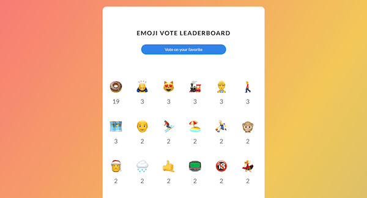

If you glance at the Linkerd2 dashboard, you should see all the HTTP/2 and HTTP/1-speaking services in the demo app show up in the list of deployments that have been added to the Linkerd2 mesh.

View the demo app by querying the URL like so:

`./expose-emojivoto.sh`{{execute}}

Finally, let’s take a look back at our dashboard. You should be able to browse all the services that are running as part of the application to view:

- Success rates
- Request rates
- Latency distribution percentiles
- Upstream and downstream dependencies

As well as various other bits of information about live traffic. Neat, huh?

Views available in the dashboard:

### SERVICE MESH

Displays continuous health metrics of the control plane itself, as well as high-level health metrics of deployments in the data plane.

### DEPLOYMENTS

Lists all deployments by requests, success rate, and latency.

Of course, the dashboard isn’t the only way to inspect what’s happening in the Linkerd2 service mesh. The CLI provides several interesting and powerful commands that you should experiment with, including `linkerd stat` and `linkerd tap`.

To view details per deployment, run:

`linkerd -n emojivoto stat deployments`{{execute}}

To see a live pipeline of requests for your application, run:

`linkerd -n emojivoto tap deploy voting`{{execute}}
